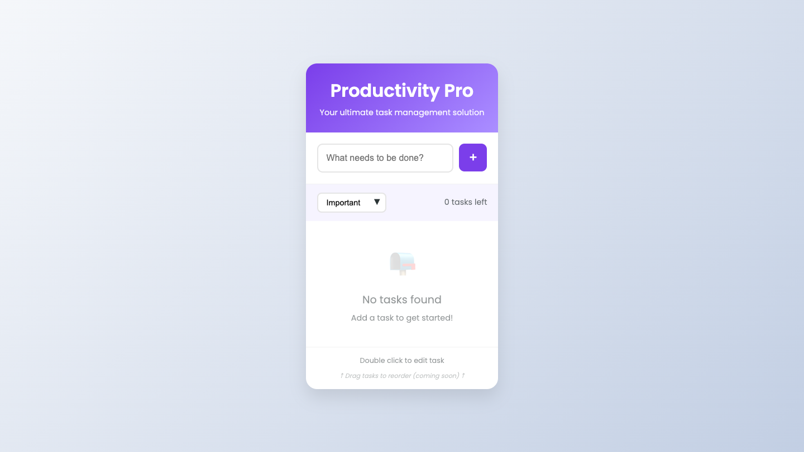
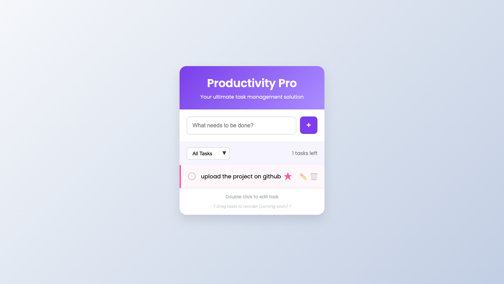
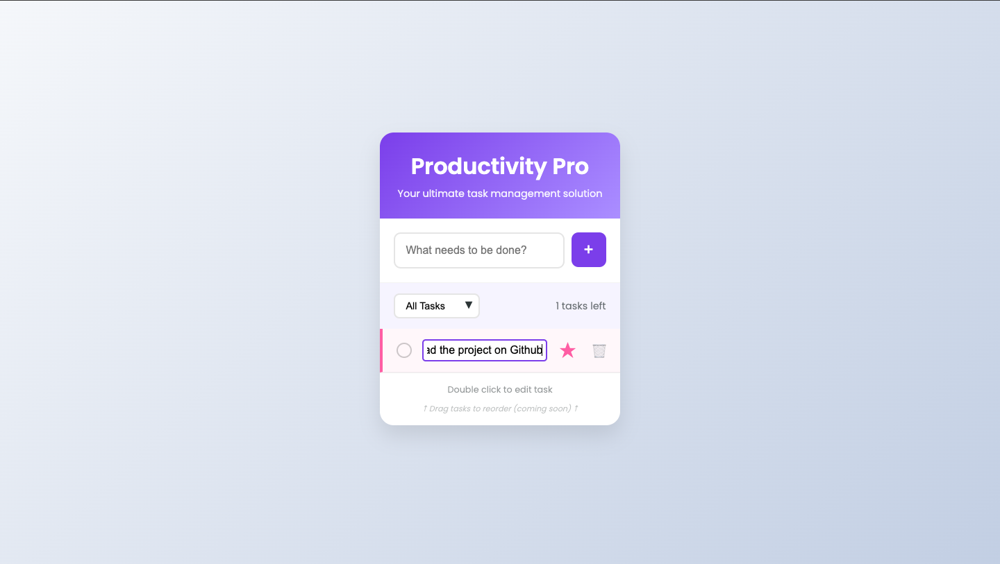
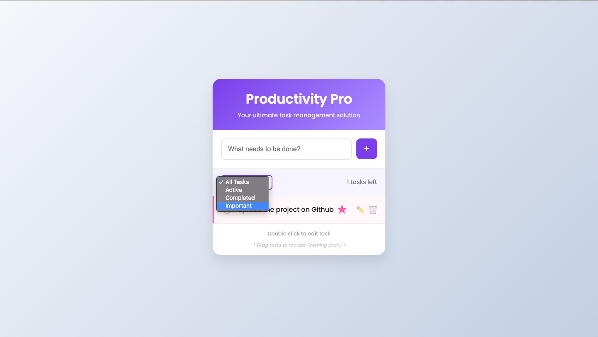

# 📝 ToDo App

A simple and responsive ToDo application built with **React**. This app allows users to:

- Add tasks
- Delete tasks
- Store tasks in **localStorage**
- Keep tasks saved even after refreshing the page

## 🚀 Features

- **Add Task**: Type in a new task and add it to your list
- **Delete Task**: Click on a task to remove it
- **Persistent Storage**: All tasks are saved in your browser using `localStorage`

## 💻 Technologies Used

- React
- JavaScript (ES6+)
- HTML5 & CSS3 (SCSS)
- localStorage API

## 📸 Screenshot

### 🏠 Main page


### 📌 Mark as important


### 📝 Edit tasks


### 🗂 Filter tasks



## 📦 Getting Started

1. Clone the repo:
   ```bash
   git clone https://github.com/MambaXan/todo-app.git
